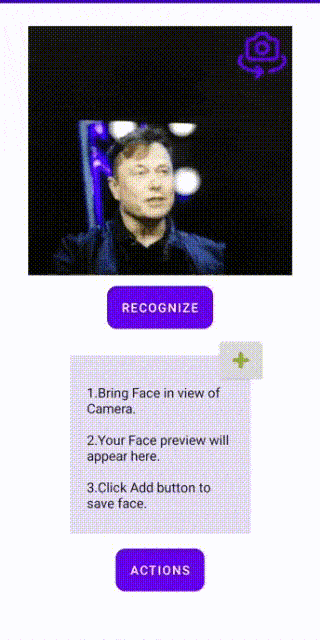
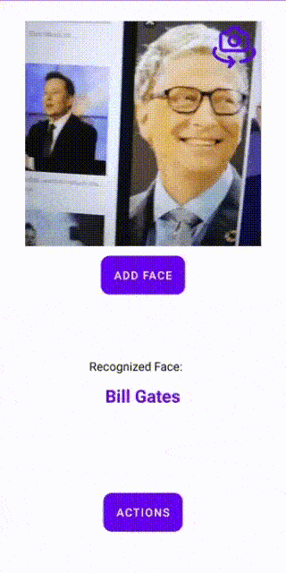
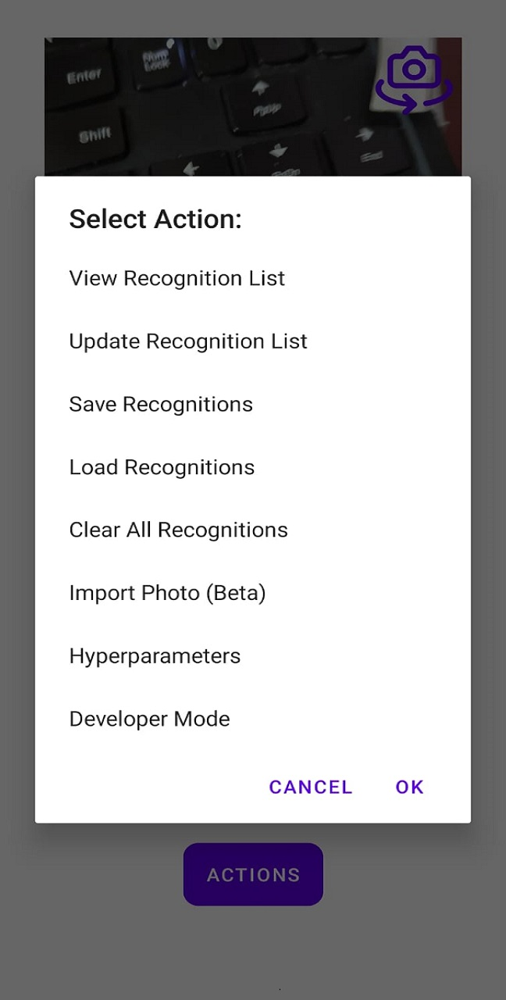
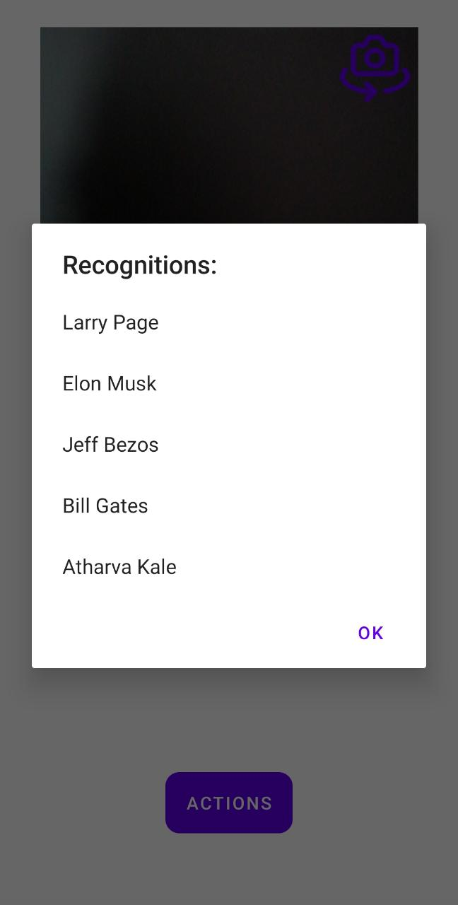

Recognition App using TfLite

Recognition module which can be easily incorporated in any Android project.

## Key Features 
- Fast and very accurate.
- No re-training required to add new Faces.
- Save Recognitions for further use.
- Real-Time and offline.
- Simple UI.
- Anti theft feature for device
- Alarm on recognising Missing People

## Tools and Frameworks used:
- Android Studio (Java)
- CameraX
- ML Kit
- TensorFlow Lite
- Sensors
## Installation

Use Import from Version Control in Android Studio or Clone repo and open the project in Android Studio.

```bash
git clone https://github.com/Shreya0706/Recognition
```
### Application file : [Recognition.apk](https://drive.google.com/file/d/1yAspmBz7A5MiPI-iLp_c0e-CEkg3mQHb/view?usp=sharing)

<!-- ## Usage
<table>
  <tr>
    <td><b>1.Add Face</b></td>
     <td><b>2.Import Face</b></td>
     <td><b>3.Recognize Face</b></td>
     
  </tr>
  <tr>
    <td></td>
    <td></td>
  
  </tr>
 </table>
 

 
 <table>
  <tr>
    <td><b>Actions</b></td>
     <td><b>View Recognitions</b></td>
     <td><b>Update Recognitions</b></td>
  </tr>
  <tr>
    <td></td>
    <td></td>
  </tr>
 </table> -->
# Action Items
- [ ] Improve Performance(Code Optimization)
- [ ] Auto face orientation for Import Photo Action.

